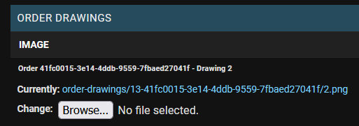

# Bugs Fixed
## 1. Atrament Canvas Clears On Window Resize

The Javascript drawing library I chose (Atrament) uses an HTML canvas element for the drawing area and needed to have a width and height assigned on initialisation. This meant that making the drawing area responsive was quite challenging.

Although the canvas could be resized after page load by resizing its parent div and stretching it to fit, doing so would break the mouse interactions so that lines were not drawn where a user clicked. In the image below, the second X was drawn by tracing the first X after resizing the window, to demonstrate the line misplacement.


The canvas could also be resized by directly changing its width and height when the window resized. However, an HTML canvas element clears all of its contents whenever the dimensions of the canvas are changed, so this means that anything already drawn on the canvas would be destroyed if the window was resized.

I looked at a number of different solutions, but eventually decided to use CSS transformations to visually scale the canvas in the browser, based on [this note](https://developer.mozilla.org/en-US/docs/Web/API/Canvas_API/Tutorial/Optimizing_canvas#scaling_canvas_using_css_transforms) in the MDN web docs. Effectively, this means that the actual canvas element has fixed pixel dimensions (1280px x 720px), but through javascript and CSS, it is scaled up or down to respond to changes to the viewport. I wanted to have a decorative notebook background to the canvas element, so that element is also scaled using CSS transformations. 

The solution I designed uses four elements, nested as follows: 

```html
<div id="scaler-holder">
    <div id="sketchbook-scaler">
        <div id="sketchbook-background">
            <canvas id="sketchbook"></canvas>
        </div>
    </div>
</div>
```

#sketchbook

* This is the Atrament canvas element.
* It has fixed dimensions of 1280px x 720px.
* It uses position: absolute to align it precisely with the SVG image in its parent div.
	
#sketchbook-background

* This element contains the SVG background image of a sketchbook.
* It has fixed dimensions of 1340px x 980px
* The image is added to the background of this div with CSS.
	
#sketchbook-scaler

* This is the element that applies the scaling transformation to the sketchbook and its backing image
* A scaling factor is calculated by dividing the current width of this element's parent  the(#scaler-holder) by the fixed width of this element's child (the #sketchbook-background element).
* The scaling factor is then applied to this element using transform: scale()
	
#scaler-holder

* This element's width is set responsively by the Bootstrap grid and is used in calculating the scaling factor for the canvas.
* This element's height is set to match its child (the #sketchbook-scaler element) to fix a layout bug detailed below.

## 2. Scaler Holder Element Height Bug

When the canvas and its background were being scaled down to fit on the page, the topmost element in the four-element structure used for scaling the canvas was being rendered as if its contents were full size. This meant that a lot of empty space was being added to the bottom of the page.


This bug was resolved by simply setting the #scaler-holder element's height to the height of the #sketchbook-scaler element at the end of the resize function.

```js
$('#scaler-holder').height(scaler.getBoundingClientRect().height);
```

## 3. Tool Selection Event Listener Bug

I added an event listener to the parent element of the tool selection buttons to use event delegation to select the tool the user had clicked on. 

```js
document.getElementById("tool-holder").addEventListener("click", function(e) {
    if (e.target && e.target.matches(".tool-button")) {
        changeTool(e.target);
        }
})
```

On testing, the function wasn't being called when the button was clicked, but was being called when the button was focused and activated by pressing the 'Enter' key. 

This issue was happening because of the way I'd structured the tool buttons as svg images nested inside button elements:

```html
<div id="tool-holder">
	<button class="tool-button">
	    
	</button>
</div>
```

When the button was clicked rather than activated with the keyboard, the img element was the event target, rather than the button, so the condition in my event handler that the event target should have the class of 'tool-button' was failing.

This was resolved by adding an additional condition to the event handler. If the img is the event target, the handler selects the event target's parent element and passes that element to the changeTool function instead:

```js
else if (e.target && e.target.matches(".tool-icon")) {
    changeTool(e.target.parentElement);
    }
```

## 4. Stroke Weight Bug

If a user changed the stroke width and then refreshed the page, the slider would stay in the position they'd set it to, but the actual stroke width would revert to its default value. This created a confusing user experience.

This bug was solved by simply setting the canvas' weight to the value of the slider when the atrament canvas is initialised on page load:

```js
const sketchbook = new Atrament(canvas, {
    [...]
    weight: parseInt(document.getElementById('stroke-weight').value),
});
```

## 5. Transparent Colour Picking Bug

If the colour picker was used on an area of the canvas that hadn't been drawn on or had been erased, the current colour of the canvas and Coloris colour selector would be set to transparent. This created a confusing experience, as drawing with this colour selected would have no effect and using the fill tool would throw an error.

  
  

I resolved this by modifying the code of my colour picker tool to check that the colour being selected was fully opaque. Because colours are handled as strings in the rgba() format, this could be done by checking that the fourth, third and second to last characters were '255' and only proceeding if so:

```js
// only change colour if new colour is not transparent
if (pickerColor.slice(-4, -1) === '255') {
    // set current color to picked color
    this.color = pickerColor;
    // dispatch an event containing the selected color
    this.dispatchEvent('colorpicked', { color: pickerColor });
}
```

## 6. Atrament Canvas Mobile Touch Draw Bug

There was an issue with the touch controls of the canvas where drawing lines would be erratic and misplaced. The screenshot below shows the result of trying to draw a straight line with touch controls.


This bug was caused by the way that the scaling factor I applied to the canvas interacted with the way that the Atrament code handled touch event coordinates.

Atrament uses different events for mouse interactions and touch interactions. Notably, the 'mousemove' event is used for monitoring mouse movements while drawing and the 'touchmove' for touch movements. 

The 'mousemove' event has the properties 'offsetX' and 'offsetY', which give the position of the cursor relative to the triggering element. These properties factor in the CSS transforms like the scaling factor I apply to the canvas, so the 'offsetX' at the far side of a fixed 1280px canvas is always 1280, regardless of how large or small the canvas has been scaled to appear.

The 'touchmove' event doesn't have an offsetX or offsetY property, so the Atrament library uses other properties to calculate the equivalent:

```js
x = position.clientX - rect.left;
y = position.clientY - rect.top;
```

Here, position.clientX/Y are the position of the touch event relative to the viewport, while rect.left/top are the distances from the canvas to the left and top edges of the viewport. Subtracting the distance to the edge from the position relative to the viewport gives the touch event's position relative to the canvas, but only if the canvas is not scaled or transformed in any way. In my case, the canvas was scaled up or down, so the conversion didn't work.

I solved this issue by replacing both the mouse events and the touch events in my fork of the Atrament library with [pointer events](https://developer.mozilla.org/en-US/docs/Web/API/PointerEvent). Pointer events are a more recent development than mouse and touch events, but they are now supported by all major browsers. 

Pointer events are hardware agnostic and have offsetX / offsetY properties regardless of the input method. To keep things tidy, I also updated the names of classes, functions, etc. to reflect the change from mouse/touch to pointer. All of the changes I made to implement pointer events are in [this commit](https://github.com/lmjh/atrament.js/commit/aa37a9a47c02eb2f1b181c13403f1cbc6d39faf0) in my fork of the Atrament repository.

## 7. Paper Background Distortion Bug

I used CSS gradients to generate decorative backgrounds for the drawing canvas that look similar to lined or squared paper. This worked as expected when applied to most elements, but when applied to the canvas element the patterns were distorted. The first image below shows how the background should look and the second shows how it actually appeared.

  
  

This was happening because the canvas element was being scaled up or down with CSS transformations. I think this is an example of a [moiré pattern](https://en.wikipedia.org/wiki/Moir%C3%A9_pattern) and is caused by the interaction of the background grid with the pixel grid of the display when scaled. 

To fix this issue, I added an element with the id of 'paper' directly before the canvas element and applied the backgrounds to that. The paper element is positioned with CSS to align with the canvas element and its height and width are set by javascript to match the canvas element. The paper element is scaled up or down along with the canvas by its parent div, but this is reversed by scaling the paper element by the inverse of the scaling ratio:

```js
paper.css('transform', 'scale(' + (1 / scale) + ')');
```

In this way, the paper element is effectively shown without any scaling applied and the moiré interference patterns are greatly reduced.

## 8. Django Crispy Forms Submission Bug

I set up a form on the user profile page to update the user's first / last name and the user's default delivery details. Because the  first / last name and delivery details were stored in different models (User and Accounts, respectively), I needed to make two separate forms in the app's forms.py file, render them both with crispy forms and submit them both together.

```html
<form action="" method="POST">
    
        
        
        <button>Update</button>
</form>
```

When I tested my forms, however, only the names were being updated. 

This was because crispy forms by default renders a <form> element around its forms, so when the submit button was pushed, only one of the nested forms was being submitted to the server.

I resolved this by adding `self.helper.form_tag = False` to the forms, to prevent them from adding form tags. I also added `self.helperdisable_csrf = True` to each form to prevent them from adding multiple unnecessary csrf tokens.

## 9. Drawing Title Not Being Saved

To handle saving user drawings to the database, I used  javascript to build a FormData object and submitted that with AJAX to a save_drawing view. The 'title' field of the form was rendered from a DrawingForm Django form, but the other fields were filled by javascript. When I came to test the forms, the title data was not being passed to the database.

This was happening because I'd assumed the title field would automatically be picked up when the form was submitted, but the form wasn't actually being submitted. My javascript function was bound to the 'save' button and was building its own set of form data and sending that to the server directly, without the 'title' string. I resolved this by simply appending the title data to the FormData object built by my function:

```js
let title = $('#id_title').val();
formData.append('title', title)
```

## 10. Lack Of Feedback On Drawing Save Preview Causing Confusing User Experience

In the save drawing modal, I included small preview images of the drawings saved in each save slot, so that users could quickly decide which they wanted to overwrite if all were already filled. However, the preview images would only change when the page was reloaded. This created quite a confusing user experience, because after a user had clicked the 'Save Drawing' button, they would receive a message to confirm the drawing had saved, but the image above that slot would be the same as before.

  

I resolved this by altering the save_drawing view of my app to return the url of the newly saved image in a JsonResponse object:

```python
response_url = drawing.image.url
return JsonResponse(
    {
        'url': response_url
    })
```

Then in the success function of my javascript ajax function, I used the new url to update the preview image of the selected save slot:

```js
success: function(response){
// find the preview image corresponding to the selected save slot
let savePreview = $('#save-preview-' + saveSlot)
// update the preview image with the url returned in the JSON response
savePreview.attr('src', response['url'])
```

  

## 11. Save  / Load Dialog Not Returning To Default State When Closed

The save / load modal dialog has hidden collapsible sections at the bottom which open to display confirmation buttons for save or load functions. When the sections open, the other controls are disabled with javascript, to avoid confusion and prevent the user from changing the settings before confirming the save / load. However, if the modal was closed before either the confirm or cancel button was clicked, the controls would still be disabled and the hidden section still showing if the modal was reopened.

I resolved this issue by adding an event listener to the modal, listening for the 'hidden.bs.modal' event which is fired by Bootstrap once the modal is hidden. I then attached a function to revert the modal to its default state once it was hidden:

```js
function restoreSaveLoadState() {
    // if the save-dialog-toggle button is currently disabled
    if ($('#save-dialog-toggle').prop('disabled')) {
        // call the function to re-enable the buttons
        enableSaveLoadButtons();
    }
    // remove the 'show' class from the two collapsible elements of the modal
    $('#save-confirm').removeClass('show');
    $('#load-confirm').removeClass('show');
}
```

## 12. Save / Load Dialogue Buttons Disabling Incorrectly

I originally had a single function (toggleSaveLoadButtons) to toggle the save / load control buttons between enabled and disabled states, which was called whenever the save / load confirmation dialogs were toggled. This worked well, until I added a function to disable the load button when there was no saved picture to be loaded. Then the load button would be re-activated if it was deactivated when the confirm dialog was opened.

I resolved this issue by splitting the toggleSaveLoadButtons function into a function to enable them and a function to disable them, then calling the functions when appropriate. The disabling function simply disables all controls, but the enabling function checks which save slot is selected and only enables the load button if a drawing is saved there.

## 13. Canvas Image Smoothing Causing Loss Of Quality

I noticed that saved images loaded from the database to the canvas seemed to be losing quality. Although some quality loss is probably unavoidable when loading images to and from an HTML canvas, the degree and speed of degradation was higher and faster than I'd expected, with images appearing noticeably blurry after only one or two save / load cycles.

On investigation, I found that the rapid quality loss issues were being caused by image smoothing, which was being applied by the browser to the images as they were loaded onto the canvas. Disabling image smoothing in the functions responsible for loading images helped to preserve the image quality. 

To test this, I drew a simple black on white line and then saved/loaded it from/to the canvas five times in sequence, once with smoothing enabled and once with it disabled. The resultant image from the tests with smoothing is considerably blurrier. The image without smoothing appears to be unchanged.


## 14. Add Drawing View Form Validation Bug

The DrawingForm, which gathers data to create and update the user's saved drawings in the database, was passing validation even when it wasn't supplied with all the needed data, which was causing errors to be thrown.

This was happening because of the way I'd configured the form to handle overwriting an existing drawing in a save slot. In my save_drawing view, if the user already had a drawing in the selected save slot, I was instantiating the form with that instance before validating the form, so that the instance would eventually be overwritten:

```python
if drawing_instance:
	form=DrawingForm(
					request.POST,
					request.FILES,
					instance=drawing_instance
					)
```

This meant that when the form reached the 'if form.isValid()' check, it was passing validation regardless of the contents of the request object, as the instance in the database had valid data which passed the test. Then, when the code tried to use the values it expected it to be in the request object, they weren't valid and errors were thrown.

I resolved this issue by refactoring the view so that the form was validated first, and then the process for overwriting existing save slots was handled afterwards by setting the new drawing's object id equal to the saved drawing's object id, if there was one:

```python
# if the user already has a drawing in this save slot
if save_slot_exists:
	# overwrite the save_slot
     drawing.id = save_slot_exists.id
```

## 15. Not Possible To Convert Messages Directly To Json

I had planned to convert Django messages into a json object which would be read by javascript and then pushed onto the DOM as bootstrap toast notifications. Unfortunately, it wasn't possible to simply render the messages as a JSON object with Django's template tags:

```
{{ messages|json_script:"messages"}}
```


I resolved this issue by creating a context processor in my notifications app which built an array with the messages:

```python
storage = get_messages(request)
message_array = []
# if there are messages in the storage
if storage:
    for message in storage:
        # append a dict containing each message and its tag to the array
        message_dict = {
            'message': message.message,
            'tag': message.tags
            }
        message_array.append(message_dict)

context = {
    'message_array': message_array
}
```

Once converted into an array, the messages could be output as JSON in the base template with `{{ message_array|json_script:"json_messages" }}` and loaded by the notifications javascript functions I had written.

## 16. Unable To Get Dict Value With A Variable Key In Templates

I wanted to display the lowest price of a product's variants on the page which showed all the available printed products. To achieve this, I built a min_prices dict and added each product name as a key with its lowest price as a value, then passed this to the page context:

```python
min_prices = {}
for product in products:        
    variants = ProductVariant.objects.filter(product=product.pk).order_by('price')
    min_prices[product.name] = variants[0].price
```

I had expected to be able to access the appropriate product's minimum price from this dict when iterating through products on the page, by passing the product name to the min_price dict as I would in python:

```
min_price[product.name]
```

Unfortunately, this isn't possible in Django's template language and returns a TemplateSyntaxError:


To resolve this, I added a custom template filter to the prints app (based on answers found in [this SO thread](https://stackoverflow.com/questions/8000022/django-template-how-to-look-up-a-dictionary-value-with-a-variable)) which would return the value corresponding to the submitted key in a dict, or None if the key was not found:

```python
@register.filter(name='get_dict_item')
def get_dict_item(dictionary, key):
    return dictionary.get(key)
```

Then used this in my template:

```
{{ min_prices|get_dict_item:product.name }}
```

## 17. Login With Item In Cart Bug

I encountered an issue where an error would sometimes be thrown when logging in to the site which read "Object of type Decimal is not JSON serializable". This bug was initially quite difficult to track down, as the traceback pointed to Django processes, rather than any of my own code. After some testing, I determined that the issue only occurred when a user logged in with an item in their shopping cart.


This bug was being caused by the way that Django serialises session data using JSON, which has issues handling Decimal objects. My ProductVariant model uses Decimal fields to represent product prices and my Cart app inherits those values. The cart session object has decimal fields in three places:

```python
{
    'cart_contents': 
        [{
	      [...]
	      'price': Decimal('7.99')
	      [...]
        }], 
	[...]
    'items_total': Decimal('7.99'),
    'grand_total': Decimal('10.99')
	[...]
}
```

The 'price' value in the cart_contents array of individual cart items was responsible for throwing the error. 

To fix the error, I converted the decimal values into strings before storing them in the session. 

```python
item_price = variant.price * item["quantity"]
item["price"] = f'{item_price}' 

context = {
        [...]
        "items_total": f'{items_total}',
        "grand_total": f'{grand_total}',
	[...]
    }
```

Although the items_total and grand_total fields weren't triggering the login bug, I converted them to strings as well, to avoid any possible future issues.

## 18. Some Sketchbook Buttons Returning Null Error

Console errors were being shown when a user wasn't logged in on the sketchbook page and some javascript functions were broken.


This was happening because some of the page's modals were only rendered if the user was logged in. When the user wasn't logged in, the javascript file would return an error as it tried to attach event listeners to elements that weren't there.

I resolved this issue by adding a json object in the template to represent the user's login status:

```
{{ user.is_authenticated|json_script:"auth" }}
```

This returns false if the user is logged out or true if the user is logged in. I used this to conditionally add some event listeners only if the user was logged in:

```js
const auth = JSON.parse(document.getElementById('auth').textContent);

if (auth) {
     document.getElementById("save-load-buttons").addEventListener( [...] );
	[...]
}
```

## 19. Error Thrown On Product Details Page If No Sketchbook Autosave Found

An error was being shown when a user opened any product details page when there was no autosave of their current sketchbook present in their browser.


This was happening because I hadn't added a fallback to the localforage function that retrieved the sketchbook autosave and loaded it into the product image overlay, to account for instances where no autosave was present. I resolved this by adding a .catch method which would load a placeholder image if no autosave was found:

```js
// retrieve the autosave of the current drawing from localforage 
localforage.getItem('autosave').then(function (blob) {
    // and load into the overlay image
    [...]
}).catch(function() {
    // if there were any errors, use a placeholder image
    let drawingURL = '/media/svg/placeholder.svg';
    setOverlay(drawingURL);
});
```

I also added the same catch method to the function which changes the overlay as the user selects different drawings on that page.

## 20. Order Drawings Not Saving In New Directory

I encountered an issue with the user's saved drawings when creating orders. The desired behaviour was that when an order was placed with drawings saved in the user's save slots, new entries should be made in the database using the OrderDrawing model and the image files should be copied into a new directory named with the order number. 

What was actually happening was that the new OrderDrawing objects were being created, but the image files weren't being copied. Instead, the image fields in the new objects were pointing at the image files already saved in the user's account. In the screenshot below, the order drawing's image has the path of the account drawing 'drawings/liamh/':


This was a problem because it meant that if a user changed their save_slot drawing after placing an order, the order's drawing would be changed too. If orders were being actually shipped from the site, this would mean that the user might not get the drawing they expected printed onto their products.

I resolved this issue by using Django's File object to create a copy of the original image and saving that to the new OrderDrawing object (based on [this answer](https://stackoverflow.com/a/21482851) on StackOverflow). After applying the fix, the order drawings are copied and the new path in '/order-drawings/' can be seen:



## 21. Issues With Webhooks And Unsaved Order Drawings

Users can request products printed either with drawings saved in their account or with the current state of their sketchbook canvas. To handle the latter, my original intention was just to upload the image blob along with the order form from the checkout page. This worked fine for orders that are submitted normally, but was problematic when I tried to implement order creation redundancy with webhooks from Stripe.

The application uses webhooks to create orders if the form submission process fails after the payment has been processed. The normal flow for this is to take the order data from a Stripe payment_intent.succeeded webhook that is received, check if it matches an order in the database, and add the order if not. However, this process couldn't work if the user requested a print of a drawing that wasn't saved in the database already, as there would be no drawing to print and it is impossible to attach the drawing to the payment intent object that is sent out to stripe when the user clicks submit.

To resolve this issue, I created a new model called OrderDrawingCache and used this to store a user's unsaved drawings when they place an order. If the user has requested a print of their unsaved drawing, the image is stored in the OrderDrawingCache database (along with the unique stripe payment intent id) before the order is submitted. Then, when the order is processed, the drawing is retrieved by its stripe pid either by the webhook handler or by the order creation view.


## 22. Empty Sketchbook In Cart Bugs

An error was being thrown by the shopping cart javascript file if the user added a product printed with their current sketchbook drawing while their sketchbook was empty.


This error was caused by the javascript file attempting to create an object URL for the null variable that was returned by localforage if no image was found.

I resolved this error by first adding some defensive code to the product details page to prevent the user from adding a product printed with their current sketchbook if the sketchbook was empty.

```js
addToCart.addEventListener('submit', function (e) {
    e.preventDefault();
    if (selectDrawing.value == '0') {
        localforage.getItem('autosave').then(function (blob) {
            if (blob != null){
                addToCart.submit();
            } else {
                displayToast('error', 'No current sketchbook doodle found. Draw something cool on your sketchbook to print!');
            }
        }).catch(function() {
            displayToast('error', 'No current sketchbook doodle found. Draw something cool on your sketchbook to print!');
        });
    } else {
        addToCart.submit();
    }
});
```

The above code prevents the product form from submitting and displays an error if the current sketchbook drawing is selected but no image is found.

This improved the user experience somewhat by preventing most issues, but it was still possible for the errors to be thrown by the shopping cart script if a user added a current sketchbook print to their cart and then afterwards cleared their sketchbook.

I resolved this by using a ternary operator so that the code would only attempt to create an objectURL from the saved drawing blob if it was truthy (i.e. not null) and otherwise set it to false.

```js
let autosaveURL = blob ? URL.createObjectURL(blob) : false;
```

Then, when the code comes to displaying the image on the page, I added a condition to only do so if the autosaveURL was truthy (i.e. not false).

It is still possible for a user to attempt to checkout an order with a blank image if they add a current sketchbook print to their cart and then clear the sketchbook afterwards, but an appropriate error message to the user was already in place to handle this on the checkout page.

## 23. Slice Method On Undefined Object Bug

After deploying the site to Heroku and transferring media files to an AWS bucket, a bug appeared on the sketchbook page when a user wasn't logged in.


This bug was caused by a change I'd made to the Javascript functions during deployment. 

I had written a function to disable or enable the save slot load button based on whether the save slot was empty. This was done by checking if the image for the save slot rendered by the template was the default blank image, indicating the save slot was empty:

```js
if ($(`#save-preview-${saveSlot}`).attr('src') == '/media/svg/blank.svg') {
    $('#load-dialog-toggle').prop('disabled', true);
}
```

This function obviously wouldn't work with the media files hosted on external servers as the 'src' attribute would need to be updated to match the external file's url. I addressed this issue by slicing the last 9 characters of the source, so the function was only checking for the filename, regardless of the actual path:

```js
if ($(`#save-preview-${saveSlot}`).attr('src').slice(-9) == 'blank.svg') {
    ...
}
```

This change caused the bug. When the user is not logged in, the load / save modal which contains the preview images is not rendered by the page template so the code which looks for the image's src attribute returns 'undefined'. This wasn't an issue before the change because the if statement would simply compare 'undefined' with the file name and find that they didn't match.

However, when I added the slice statement, the code was trying to call the slice() method on an undefined object, which caused it to crash.

To resolve this, I simply added a condition to check that the save preview image source was truthy before running the condition containing the slice method:

```js
let savePreviewSrc = $(`#save-preview-${saveSlot}`).attr('src')
if (savePreviewSrc) {
    if (savePreviewSrc.slice(-9) == 'blank.svg') {
        ...
    }
}
```

## 24. Cross-Origin Image Files Causing Tainted Canvas

After deploying the site and configuring the static and media files to use AWS S3  storage, some of the sketchbook functions stopped working correctly and errors were being thrown.


On investigation, it seemed that the canvas would work perfectly up until an image was loaded onto it from the database, and then any functions that saved the image from the canvas (i.e. the autosave, undo and save to database functions) would be blocked.

This was happening because of cross-origin security measures imposed by the browser. When an image is loaded onto a canvas from a different domain without proper configuration, the browser considers the canvas 'tainted' and will block any attempts to retrieve the image data from the canvas. I didn't have this issue in my development environment because the images were all stored locally, but moving the images to AWS S3 meant that they were coming from a different domain.

Fixing this issue wasn't very complicated - though diagnosing it and finding the necessary steps was quite challenging! (This article)[https://developer.mozilla.org/en-US/docs/Web/HTML/CORS_enabled_image] was helpful in understanding some of the required process.

First, I had to configure my S3 bucket's Cross-origin resource sharing (CORS) settings to allow my deployed site as an origin and provide the Access-Control-Allow-Origin header. I set up my CORS config file like this:

```
[
    {
        "AllowedHeaders": [
            "Authorization"
        ],
        "AllowedMethods": [
            "GET",
            "HEAD"
        ],
        "AllowedOrigins": [
            "https://doodle-this.herokuapp.com",
            "http://doodle-this.herokuapp.com",

        ],
        "ExposeHeaders": [
            "Access-Control-Allow-Origin"
        ]
    }
]
```

Next, I needed to add a new step to my function that loaded images onto the canvas. Before loading the downloaded image onto the canvas, I needed to set the crossOrigin attribute of my newly instantiated Image object to 'Anonymous':

```js
let drawing = new Image();
drawing.crossOrigin = "Anonymous";
```

## 25. Cross-origin Image Files Bug in Chromium Browsers

After configuring my S3 bucket and javascript code to fix the CORS issue with my canvas element, I encountered another similar issue that seemed to be specific to the Chrome browser. When trying to load an image from the database onto the canvas, an error was thrown stating "No 'Access-Control-Allow-Origin' header is present".


On investigation, it seems that this is a known issue with the way that Chromium browsers (like Chrome and Edge) handle caching of images. The issue and the workaround are discussed in detail [here](https://www.hacksoft.io/blog/handle-images-cors-error-in-chrome). 

In brief, Chrome will throw these errors if an image is requested and rendered **without** CORS headers and then later the same image is requested **with** CORS headers. This happens because Chrome caches the image without the headers and then when it's requested with headers, Chrome uses the headerless cached image.

In my case, the user's saved drawings were being loaded into the preview image boxes in the Save / Load modal without CORS headers. Then, when my javascript function tried to get the images with CORS headers to load onto the canvas, Chrome was using the cached images and failing.

The simplest workaround for this issue is to add a query string to the end of the second request, so the browser will see a different URL and fetch a new version of the image. I did this by simply adding a "?no-cache" GET parameter to the drawing url returned by my get_drawing view:

```python
response_url = drawing.image.url + '?no-cache'
```

## 26. Shopping Cart Site Lockout Bug

While testing the CRUD functionality for the product management systems, I discovered a bug with the shopping cart app that could effectively lock users out of the site. If a site admin deleted a Product Variant while a user had that Variant in their shopping cart, the user would get a 404 error on every page of the site. 

This was happening because of the way the cart context processor worked. The cart_contents()  function is called before loading every page. It iterates through the Product Variants in the cart, counting them and adding up their prices. To do this, it looks up the Variant in the database:

```python
variant = get_object_or_404(ProductVariant, pk=item["variant_id"])
```

Because it uses the get_object_or_404 method, if the Variant has been deleted a 404 error is returned. Because this method is called before loading any pages, a user with a deleted item in their cart gets a 404 error for every page on the site.

I resolved this issue by replacing the get_object_or_404 method with a database query that returns 'none' if no item is found, then continuing with adding the item only if a result is found:

```python
variant = ProductVariant.objects.filter(pk=item["variant_id"]).first()
if variant:
	[...]
```

I also added a 'cleaned_cart' list outside the loop and added items to it as they were found. After the loop, the cart saved in the session is replaced with the 'cleaned_cart', with the effect that any deleted products are removed from the cart on page load:

```python
cleaned_cart = []
for item in cart_contents:
    variant = ProductVariant.objects.filter(pk=item["variant_id"]).first()
    if variant:
        cleaned_cart.append(item)
        [...]

request.session["cart"] = cleaned_cart
```

## 27. Shopping Cart Order Confirmed Page Bug

When a user is redirected to the order_confirmed page after placing an order, their shopping cart is emptied as the order has been completed. This is done by the order_confirmed view. 

Originally, the user could also visit the order_confirmed page for any of their past orders by clicking a link in their order history. This was intended to allow users to view the full details of their past orders, but an unexpected consequence of this was that if a user viewed one of their past orders while items were in their cart, their cart would be emptied by the order_confirmed view.

I resolved this issue by adding a new view and template called 'order_details', which is linked to from the order history instead of the order_confirmed page. This has the same content and layout as the order_confirmed page, but without the code in the view responsible for emptying the shopping cart and other post-order actions.

## 28. Canvas Drift Bug

While compatibility testing the application in Google Chrome, I noticed a bug that was causing the user's drawing on the canvas to drift down and right slightly whenever the drawing was saved and re-loaded. After several save/load cycles, the effect left a quite noticeable empty space above and to the left of the drawing. 


On further investigation, I found the same effect happened in Edge (which is another Chromium browser) and also in Firefox, though the effect was much less pronounced in Firefox.

I wasn't able to fully get to the bottom of why this issue was happening. Some of my research suggested it could be to do with how the browser's rendering engine handles scaling an image onto a canvas or how it handles partial pixels, but my images should always be exactly the same size as the canvas so I'm not sure if either of these answers are correct.

In any case, I resolved this issue through trial and error by offsetting the origin of the canvas drawImage functions by -0.5 pixels:

```js
canvasContext.drawImage(event.target, -0.5, -0.5);
```

This seems to solve the canvas drifting problem, and didn't cause any positional drift in the opposite direction.


