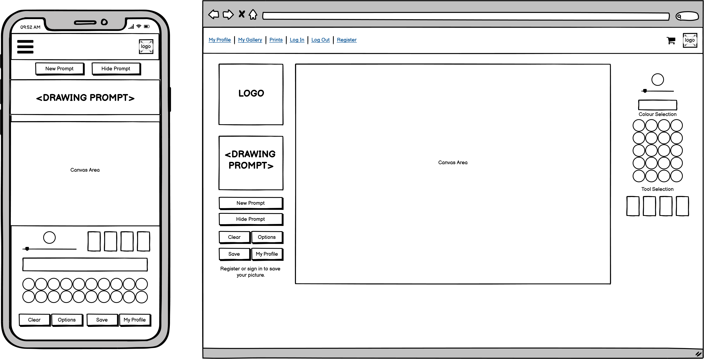
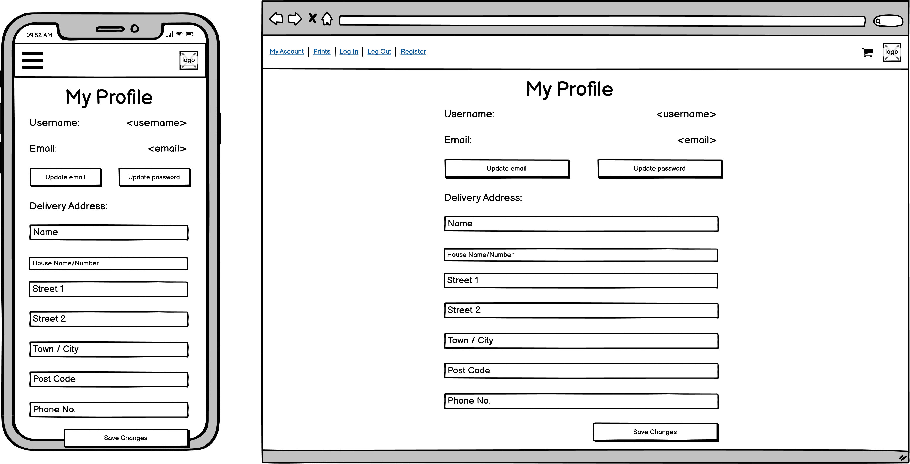
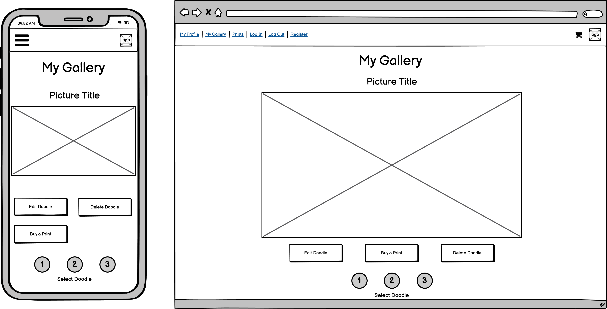
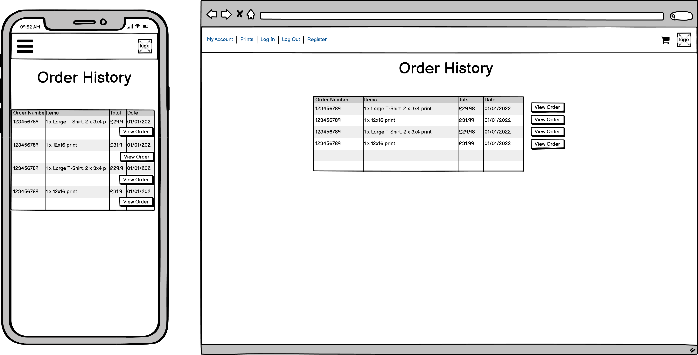
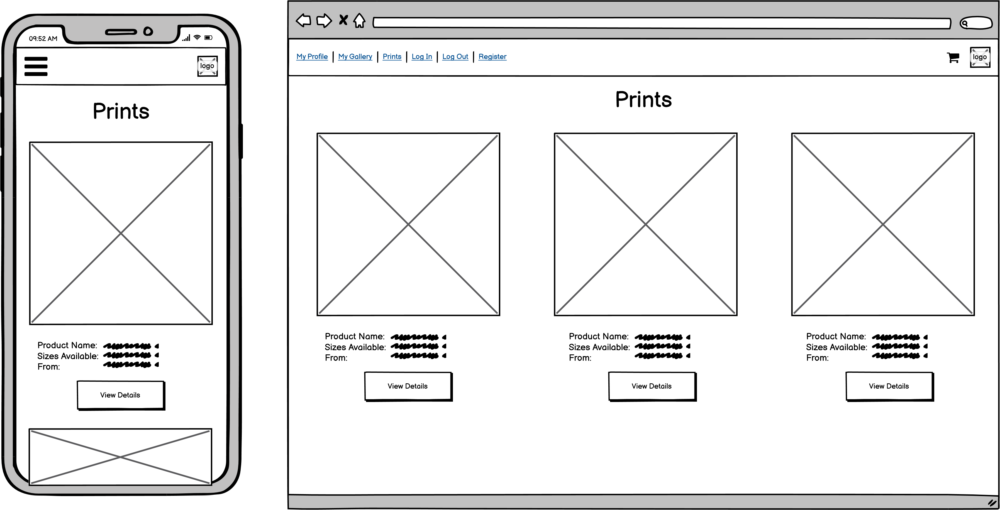
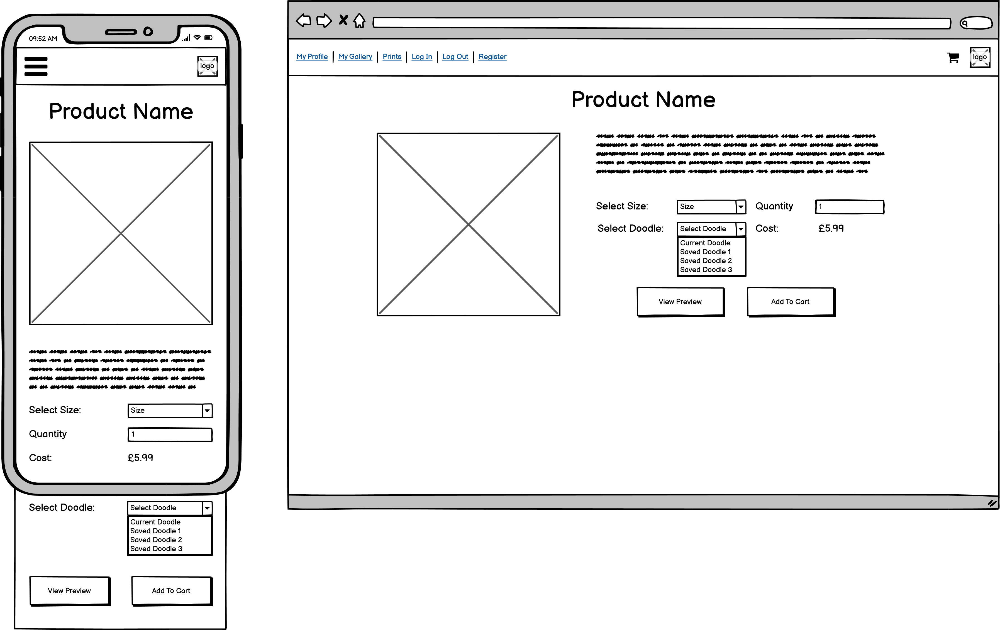

# Doodle This

Doodle This is a drawing web app that gives users randomly generated drawing prompts and a blank canvas to draw on. Users can save their drawings in the database and can purchase products like prints or mugs with their favourite pictures printed on them.

***

## User Experience

### User Stories

#### 1. New User Stories

* 1.1. As a new user I want to be able to quickly understand the purpose of the site so that I can decide if it provides value to me
* 1.2. As a new user I want to be able to quickly understand how to use the application so that I can start using it to create art
* 1.3. As a new user I want to be able to know where to look for help so that I can find answers to my questions
* 1.4. As a new user I want to be able to easily sign up for an account so that I can store my details and save my artwork

#### 2. Registered User Stories

* 2.1. As a registered user I want to be able to easily log in to or out of my account so that I can access the data I've stored
* 2.2. As a registered user I want to be able to save my drawings so that I can access them later
* 2.3. As a registered user I want to be able to edit my saved drawings so that I can make changes to them after they're saved
* 2.4. As a registered user I want to be able to delete my saved drawings so that I can get rid of old drawings and make space for new ones
* 2.5. As a registered user I want to be able to save my shipping details so that I can checkout more quickly in future

#### 3. Drawing App User Stories

* 3.1. As a drawing app user I want to be able to use a selection of basic drawing tools so that I can create drawings
* 3.2. As a drawing app user I want to be able to select from a number of preset colours so that I can quickly create art with a balanced palette
* 3.3. As a drawing app user I want to be able to use custom colours so that I can draw with any colour I want
* 3.4. As a drawing app user I want to be able to generate random drawing prompts so that I can quickly get ideas about what to draw
  
#### 4. Shopper User Stories

* 4.1. As a shopper I want to be able to purchase products printed with my drawing so that I can own or gift a physical copy of my drawing
* 4.2. As a shopper I want to be able to view the products available to purchase so that I can decide if there are any I'd like to buy
* 4.3. As a shopper I want to be able to view product details so that I can find out more about the product and any variants available
* 4.4. As a shopper I want to be able to view a preview of my drawing on a product so that I can get an idea of how my artwork would look when printed
* 4.5. As a shopper I want to be able to easily manage my shopping cart so that I can select the products I want and see the costs
* 4.6. As a shopper I want to be able to easily checkout and pay for my order so that I can purchase the products I want

#### 5. Admin User Stories

* 5.1. As a site administrator I want to be able to add new products and product variants so that I can sell new products in the store.
* 5.2. As a site administrator I want to be able to update the products and product variants in the store so that I can change their details, prices and images.
* 5.3. As a site administrator I want to be able to delete products and variants from the store so that I can remove products that are no longer sold.

### Design

The visual design of the site is inspired by the look of modern, professional design software (such as Adobe Photoshop or Affinity Designer), which usually features a dark user interface. 

Dark user interfaces are easy on the eye for people who spend a long time drawing or designing, and also have the advantage of providing an undistracting backdrop to the user’s artwork. They can, however, look quite cold and unwelcoming to some people. 

My aim with the visual design of this project was to try to implement a generally dark UI, inspired by modern art and design software, but with some design touches to give it a warmer, more casual and fun look.

#### Colours

Doodle This features a dark UI and most site elements are rendered in shades of dark grey. 

To add some vibrancy and energy to the design, I chose a bright, warm orange colour as the primary brand colour and this is used throughout the site to accent and emphasise elements.

I added a two-tone vector drawing of the site’s logo image to the background of every page. Most content is rendered on semi-transparent panels that show the background, which helps prevent surfaces from looking too flat.

I also added drop shadows to many site elements, to give the design a sense of depth. Some elements (such as the navigation bar) also have subtle gradients applied to them to enhance this impression of depth.

Very few colours other than the main brand orange colour are used in the site outside of the sketchbook page. This is intended to reduce visual clutter and to make the user’s own colourful drawings stand out on pages like the product details views, the shopping cart and the gallery section. It also serves to make the few elements that do have colours applied - like the toast notifications and some call to action buttons - stand out against the background.

#### Typography

Two different fonts are used on the site, both sourced from [Google Fonts](https://fonts.google.com/). 

[Baloo 2](https://fonts.google.com/specimen/Baloo+2)  is used for headings, buttons and the site logo. Its wide, rounded letters work well in heavier font weights and give it a friendly appearance. All other elements use [Quicksand](https://fonts.google.com/specimen/Quicksand), which is similar to Baloo 2 in that it has rounded letters, but is thinner and better suited to lighter font weights. Both fonts are highly legible, which is always a priority when selecting webfonts, and I think the combination of two light / heavy rounded fonts works well.

#### Imagery

The sketchbook page features a vector illustration of a sketchbook, which I drew to provide the backdrop for the user’s drawing area. In contrast to the majority of the rest of the site, which is rendered mostly in dark greys with accenting from the brand orange colour, the sketchbook illustration features a few different colours and shades. This sketchbook and the way it’s coloured is intended to make the drawing area feel natural and welcoming, inviting users to doodle on the page.

When designing the four tool icons, I wanted to make the purpose of the tools as clear as possible, while also having a distinctive style and aesthetic. I settled on designs that use stark dark/light contrast and are highlighted with the bright brand colour when hovered or selected. The buttons also expand a little when hovered or selected, which gives them a slight impression of tactility, like they’re being pulled upwards by the user.

On the prints page and the individual products pages, I chose to use product mockups with bright white backdrops, as this makes them stand out strongly in the context of the site’s dark interface. The product mockups are all sourced from [mockups-design.com](https://mockups-design.com/).

### Wireframes

| Page          | Wireframe                                                     |
|---------------|---------------------------------------------------------------|
| Sketchbook    |     |
| My Profile    |     |
| My Gallery    |     |
| Order History |  |
| Prints        |         |
| Product       |   |

***

## Features

### Sketchbook
* The core feature of Doodle This is the sketchbook, where users can draw using the range of colours and tools provided.
* The interactive canvas is provided using the library [Atrament JS](https://github.com/jakubfiala/atrament.js). I selected this library because it is relatively lightweight and it provides a smoothing option. The smoothing feature simply smooths out a user’s strokes, to avoid jagged, shaky lines being drawn. In my opinion, this makes drawing feel more fluid and natural.
* The Atrament library provides the functionality for the Pencil, Fill and Eraser tools.
* I selected and implemented a range of preset colours which I hope will be versatile and diverse enough to cover a wide range of uses, while still being tonally complimentary.
* I added a colour mixer plugin [(Coloris)](https://github.com/mdbassit/Coloris), which allows users to mix their own colours if they want a colour or shade not provided by the presets.
* Having a colour mixer tool made it necessary to have some way to store or retrieve colours, since it could become frustrating for users to mix a new colour, use it, then switch to a different colour and have no simple way of getting the old colour back. My solution to this was to provide a colour picker tool, with which users can retrieve any colour from their canvas with a click. The Atrament library didn’t have a colour picker tool by default, so I forked the library and added this myself, among a few other changes and bug fixes. My fork of the Atrament library is [here](https://github.com/lmjh/atrament.js/).
* Stroke width can be selected by using a slider.
* I added an undo feature, which undoes the last action the user took. The undo feature is implemented by locally storing a copy of the user’s canvas before they take an action, then loading it back when they click ‘Undo’.
* I also added an autosave, which is similar to the undo feature but saves the user’s canvas after each action rather than before. The autosave allows users to leave the sketchbook page and return without losing their work. It also allows users who aren’t logged in to place print orders, as it persists their sketchbook contents between pages.
* Users with accounts can save their drawings and then load them back onto the canvas using a Save / Load menu. 
* An options modal allows users to adjust the degree of stroke smoothing applied to their lines and to turn on and off Atrament’s adaptive stroke feature, which makes lines thicker based on the user’s stroke speed.
* The options modal also allows users to change the paper background of their sketchbook. This was a feature I added just as a decorative option, so users could pick a background they liked the feel of.

### Prompt Generator
* I created an app to randomly generate drawing prompts for users.
* The site uses AJAX to request new prompts and then display them on the page when a user pushes the ‘new prompt’ button.
* The prompts use word lists and preset patterns to create random prompts.
* It is straightforward to add additional words to the lists using Django’s admin.
* The words and patterns currently in the system can make almost 2.5 million different unique combinations.

### Onboarding and Help

* To help users quickly get started with the application, I wrote a tour of the sketchbook page’s features using the [intro.js](https://introjs.com/) library.
* The tour provides users with an overview of all the main features of the sketchbook.
* Further help and information is provided by an FAQ page which is linked to in the main nav bar.

### User Accounts

* Users can sign up for a persistent account with a username and password which allows them to store data.
* The main feature of user accounts is the ability to save and load drawings. Users are provided with three save slots in which they can save drawings. Users have full CRUD functionality with regard to their drawings.
* Users can create / save drawings using the Save / Load menu.
* Users can read / view drawings using the Gallery section of the Account page.
* Users can update / load drawings by using the Save / Load menu to load the drawing onto their canvas, then saving it back into a save slot.
* Users can delete their drawings by using the Delete option in the Gallery section.
* As well as managing drawings, users can use their accounts to save address and contact information for future orders.
* Users can also use their account to view a history of their orders.

### Ecommerce Features

* Doodle This has fully functional ecommerce features. The Doodle This shop allows users to buy products printed with the drawings they’ve created with the sketchbook feature.
* Users can select a type of product from the main ‘Buy Prints’ page. Three types of product are provided currently.
Clicking on one of the products takes users to a product details page for that product.
* On the product details page, users can select some options. Each product has ‘variants’ - either size or colour. The variants can have their own individual prices, different images, and / or unique descriptive text shown beneath the main product description. These elements will be updated as the user changes the variant selection.
* I selected the products that are available to showcase different use cases. The framed prints have size variants which all use the same image but have different prices. The mugs have colour variants which have the same price but different preview images. The t-shirts are the simplest product type - they have size variants which have both the same preview image and the same price. The t-shirts also have no additional descriptions, which the other two products’ variants each have. This is to demonstrate that the additional descriptions are optional.
* Users can select which of their drawings they wish to print on the product and see a preview of how that drawing might look. The preview is updated automatically as users change their drawing selection.
* Users can add their selected product and drawing combination to their shopping cart. The cart icon updates automatically with the number of items it contains.
* Users can manage their cart contents on the cart page. 
* Each cart item has a quantity input along with Update and Remove links.
* The checkout page allows users to enter delivery and payment information and place orders. Users with accounts can prepopulate the delivery fields by saving their details, though an account is not required to make a purchase.
* Payments are handled by Stripe. Stripe webhooks are used to confirm payment and ensure that orders are created in the database after payment is made, even if there are issues in the user’s browser.
* Users are redirected to an order confirmation page and sent order confirmation emails after orders are placed.
Users with accounts can view their order history on their Account page and also view individual any order’s details on a dedicated page.

### Product Management

* Users who are signed in with an account marked as ‘Staff’ get access to a dedicated product management page, accessed via a dropdown on the nav menu.
* The product management page presents key details of every product, product variant and product image in the database in tables.
* Staff users have full CRUD functionality with regard to the products, product variants and product images in the shop.
* Users can create products, product variants and product images by clicking the ‘Add’ button at the bottom of each table.
* Users can read most of the important information about shop items in the tables on the Product Management screens. Clicking the Edit links will show all of the item’s details, prepopulated into a form.
* Users can update any items by clicking the Edit link in the table, changing the form values and submitting the form.
* Users can delete items by clicking the Delete links in the tables. Confirmation modals are used to prevent unintended deletions. 
* Some items can be restricted from being deleted if they are in use (e.g. an image cannot be deleted if it is in use by a product). However, any item can be deleted if the items currently restricting it are either changed or deleted themselves.
* The Product Image add and edit pages require users to enter values for the overlay that will be used to position a user’s drawings over the product image on the product details page. To facilitate this, I wrote some javascript which loads the new product image the user intends to upload into a preview section, then places a semi-transparent orange overlay on top of it, to show the user where the overlay will go based on the current overlay values. The overlay preview updates automatically as the values are adjusted.

### Notifications

* I built a dedicated Django app to handle the site’s user notifications.
* The app uses a context processor to gather messages from Django’s message framework and javascript to push the notifications onto the dom as Bootstrap toasts, then remove them from the dom after a set time.
* In the spirit of Django’s reusable app philosophy, I wanted the notifications system to be easy to port into other projects. All that’s required to use the app to provide notifications is to add it to a project, then add four elements to the project’s base template: 

    * An HTML element to contain the notifications (usually with position:fixed and a high z-index attribute, to ensure visibility).
    * The src link to the notification app javascript.
    * The array of messages gathered by the context processor, output by the template as json script.
    * The Bootstrap 5 css/js files, if not already present.

* The notification app uses Django’s message tags (debug, info, success, warning, error) to style and configure the resultant toast notifications. Doodle This only uses two styles of notification (with a red or a blue heading line), but a different style for each tag can easily be implemented with CSS.
* As well as displaying on page load based on messages in Django’s message framework, notifications can also be triggered on pages by calling the javascript function displayToast() with a tag and a message. This is used by Doodle This to provide feedback in various scenarios, such as when images are loaded/saved on the sketchbook page.
* HTML can be added to the message text to further customise the layout and functionality of the notifications. For example, a ‘Checkout Now’ button is added to the notification confirming that a product has been added to the cart.

***

## Database Design

Doodle This uses an SQL relational database. An SQLite database was used in the development environment and the deployed site uses a PostgreSQL database. The full schema of models is below.

### Accounts App Models

Two models have been defined for the Accounts app. 

The UserAccount model has a one-to-one relationship with the User model from Django’s authentication system. An instance of the UserAccount model is created automatically when a User instance is created. The UserAccount model stores a user’s delivery information.

The Drawing model is responsible for storing a user’s saved drawings. It has a many-to-one relationship with the UserAccount model, reflecting that a single user can have multiple saved drawings. The Drawing model stores the drawing’s title, its save-slot, and the image itself.

### Prints App Models

Four models have been defined for the Prints app.

The Category model is a model for categorising products. It contains a name (which must be unique) and a display_name for storing a more human-readable name. The Category isn’t currently used in the front-end of the site, but is included as it helps to keep Products organised and will be used for filtering when the shop's inventory grows.

The Product model has a many-to-one relationship with Category and represents a specific type of product. For example, the ‘T-Shirts’ Product belongs to the ‘Clothing’ category. The Product model stores a description of the product and its name. 

The Product model also stores the product’s ‘variant type’, which refers to the kind of variants the product has (see below). The two variant types currently defined are ‘Colours’ and ‘Sizes’, though more could be added if needed. For example, a product might have ‘Weight’ or ‘Length’ variants, etc.

The ProductVariant model has a many-to-one relationship with Product and represents each individual variant of a Product. For example, the ‘Mugs’ product has the variant_type of ‘Colours’ and two variants, ‘black’ and ‘white’. The ProductVariant model stores the variant’s name, its SKU (which must be unique), its price and also the Product to which it belongs. It can also optionally have an additional description and an image. 

Different variants of the same product can have different prices and images. In the deployed site, this functionality can be seen on the Framed Prints page, where larger prints have higher prices, and the Mugs page, where a preview image of both white and black mugs is available.

The ProductVariant’s name and display_name fields do not have to be unique, because it is likely to be necessary for there to be duplicate names (e.g. a T-Shirt and a Hoodie might both have a ‘Large’ variant). However, a Product shouldn’t have two ProductVariants with the same name. The ProductVariant model therefore uses the ‘unique_together’ option to disallow duplicate names for the same Product ForeignKey.

The ProductImage model represents the images of products shown to customers on the prints pages. It has a one-to-many relationship with both Products and ProductVariants. ProductImages store an image and the information required to overlay the user’s drawings over the image on the print details pages.

### Orders App Models

Four models have been defined for the Orders app.

The Order model represents an order that the customer has placed. Instances of this model are created after payment has been confirmed by Stripe, either by submission of a form to the checkout view or by a function triggered by a Stripe webhook, if the form submission fails.

The Order model contains the main details of the order, including delivery and contact details, a unique order number, costs, and the stripe payment id. If the order was placed by a logged-in user, the user’s account is linked as a ForeignKey (many-to-one relationship).

The OrderDrawing model represents a user’s drawing that they wish to have printed on a product. The model stores the image itself and the ‘save slot’ it comes from (save slot 0 is used for unsaved drawings from the user’s sketchbook). Each OrderDrawing is linked to  a single Order with a ForeignKey field (many-to-one) but can be linked to several OrderItems (one-to-many).

The OrderItem model represents each item in an order. Each OrderItem is linked to a single Order, a single OrderDrawing and a single ProductVariant by ForeignKey (many-to-one).

Each OrderItem represents a unique pairing of ProductVariant and OrderDrawing for a particular order (e.g. a ‘black mug’ printed with save slot 1 is a separate OrderItem from a black mug printed with save slot 2). OrderItems store the quantity and price of the particular variant/drawing pairing they represent.

The OrderDrawingCache model is used to store unsaved drawings (i.e. drawings directly from the user’s sketchbook, not from a save slot) while orders are processed. This is necessary as otherwise it wouldn’t be possible to create orders with unsaved drawings by webhook, as it is not possible to pass an image to Stripe to be returned with the payment data.

When a user places an order with an unsaved drawing, the javascript first uses AJAX to post the unsaved drawing and the Stripe payment intent id to the server, where they are stored in an OrderDrawingCache instance. Once payment is processed, the drawing is retrieved using the unique payment intent id by whichever process is creating the order (the checkout view if the order form was submitted successfully, or the webhook if it wasn’t).

### Prompts App Models

Four simple models were defined for the Prompts app, each consisting of a list of words for use in the random drawing prompt generation functions that I wrote.

Prompt generation works by first randomly selecting a pattern function from seven predefined patterns, then randomly selecting words from the Prompts app models to fill out the pattern. For example, if the adjective_creature() pattern function is selected, the function will randomly select a word from the Adjective table and a word from the Creature table, then combine them into a string and return it.

The Activity and Location models each only have one field, which can be a single word or a sentence fragment (e.g. activity: “running” or location: “in a forest”).

The Adjective and Creature models additionally have a ‘determiner’ field which stores the word’s determiner (‘a’ or ‘an’) and is used conditionally by the prompt functions depending on the position of the word in the pattern. For example, the creature_location function would use the creature’s determiner (‘a dog in a forest’), while the adjective_creature_location function would use the adjective’s determiner (‘a good dog in a forest’).

The Creature model also has a plural field which stores the plural word for that creature. This isn’t used yet by any of the patterns, but is included as it will be used in planned additional pattern functions in the future.

***

## Future Features

### 1. Improved Product Overlay Preview

I have built a custom image upload widget which shows a preview of the image to be uploaded and sets an overlay over it using the user's input. This works well, but it's a little fiddly to have to guess at the width and offset numbers and get to the right values through trial and error. A better system would allow users to position and scale the overlay with the mouse and then have the offset and width values automatically generated.

### 2. Better Image/File Management. 

By default, Django doesn't delete files (such as the images in image fields) when they're replaced; it simply adds a new file and updates the pointer. This is good for maintaining database integrity when multiple models could reference the same files, but in my case it means the number of images stored could grow exponentially as users update their saved drawings.

This issue could be managed by some functions to regularly scan for images that are stored but not referenced by any models and delete them. Similarly, images from orders that have been completed could be removed. 

Packages like [django-cleanup](https://github.com/un1t/django-cleanup) and [django-unused-media](https://github.com/akolpakov/django-unused-media) are available, which may assist with implementing this.

### 3. More Varied Drawing Prompts

The current drawing prompt system is adequate and provides enough variety to be a good proof of concept, but it could be improved. Simply expanding the words lists would be an improvement, and it would also be quite simple to add more patterns.

Another improvement I'd like to make with more development time would be to add some configurable settings to the prompt generation. A complexity option would be useful, so users could request simple prompts or more challenging prompts. It could also be possible to add categories to some of the word lists and allow users to select categories that interest them (e.g. animals, people, certain activities, etc.).

### 4. Replace Functions With AJAX Views

Some of the site's view functions trigger unnecessary redirects, when AJAX functions could perform the same actions without forcing a page change or reload. For example, the shopping cart redirects the user back to itself when updating cart items. This could be achieved by making an AJAX request and then pushing resulting notifications with the Javascript notifications app I built.
    
### 5. Improved Colour Mixer Labelling

I don't think it's very clear at the moment that users can click the Coloris colour mixer button to mix their own colours. This is pointed out in the introductory tour, but not all users will go through that. A label or symbol of some kind could be added to make this feature more obvious.

### 6. Portrait Mode

As well as simply providing users with more options, adding a portrait mode to the drawing canvas would likely improve the experience for smartphone users.

The sketchbook page layout is responsive and I've tried to make the best use of the available screen space on a range of devices. However, a profile drawing mode would likely be a better experience for smartphone users.

Adding another canvas shape option would add another order of complexity to virtually every other site function, so I ruled it out for this time-limited project. I would like to revisit this in the future, though.
    
### 7. Canvas Zoom

Another option for improving the site experience for smartphone users would be an option to zoom and pan the canvas. The site already uses CSS scale transforms to resize the canvas to respond to viewport dimensions. The same technology could be used to allow users to zoom.
    
### 8. Subscription Service for More Save Slots

Users are limited to three save slots. This was a design decision based on keeping things simple and avoiding the issue of exponential storage requirement growth that could result from offering unlimited drawing storage. However, it could be possible to offer users more drawing save slots for a small subscription fee, which would offset the storage costs.
    
### 9. Improved Product Management

The product management sections of the site are functional but aren’t the most aesthetically pleasing parts of the site. I decided not to spend too much time on the look of these pages, as they are only intended to be viewed by staff and the functionality is more important. A little more time spent here could improve the UX for staff, though.

Additionally, the product management main page uses responsive Bootstrap tables to display information about the shop items. These do the job, but the way Bootstrap tables are made responsive is by allowing horizontal scrolling on small screens. This means that all of the information and tools are accessible, but the user experience isn’t great on small screens. 

I decided this wasn’t a huge concern as, again, these pages are only for staff and the functionality is the important part, but with more development time I’d like to replace the tables with better responsive data layout, like those found on the Cart, Checkout and Account pages.

### 10. Social Media Integration

Another nice feature to have would be some forms of social media integration. Simply allowing users to share their drawings to social media sites could be a nice feature. 

It might also be possible to facilitate users sending something like a drawing challenge to contacts on social media. This could be a randomly generated or user-written drawing prompt that a user sends to one or more friends, who attempt to draw it and send back their results.

***

## Technologies

### Languages Used

* [HTML5](https://en.wikipedia.org/wiki/HTML5)
* [CSS3](https://en.wikipedia.org/wiki/CSS)
* [JavaScript](https://en.m.wikipedia.org/wiki/JavaScript)
* [Python](https://en.m.wikipedia.org/wiki/Python_(programming_language))

### Frameworks, Libraries & Programs Used

[GitHub](https://github.com/) - Used for version control.  
[GitPod](https://gitpod.io/) - Used to write all code and test before deploying to GitHub.  
[Django 3.2](https://docs.djangoproject.com/en/4.0/releases/3.2/) - Used as the project's web framework.  
[Bootstrap 5](https://getbootstrap.com/) - Bootstrap 5 framework used extensively to create layout and styling of site.
[jQuery](https://jquery.com/) - Used extensively, particularly in the Sketchbook javascript file.  
[Heroku](https://heroku.com/) - Used to deploy the site.  
[Atrament.js](https://github.com/jakubfiala/atrament.js) - Used to provide the drawing canvas and the pencil, fill and eraser tools.  
[Coloris](https://github.com/mdbassit/Coloris) - Used to provide the colour mixer on the sketchbook page.  
[intro.js](https://introjs.com/) - Used to create the user onboarding tour.  
[Allauth](https://github.com/pennersr/django-allauth) - Used to provide many user account features.  
[Crispy Forms](https://github.com/django-crispy-forms/django-crispy-forms) - Used along with [Crispy Bootstrap 5](https://github.com/django-crispy-forms/crispy-bootstrap5) to style Django forms.  
[localForage](https://github.com/localForage/localForage) - Used to handle all storage of data and images in a user's browser.  
[Balsamiq](https://balsamiq.com/) - Used to produce design wireframes.  
[Materialize](https://materializecss.com/) - I used a few box shadow styles from the Materialize CSS framework, as I prefer these to Bootstrap's native shadow classes. 
[Affinity Designer](https://affinity.serif.com/en-gb/designer/) - Used to design logo, icons and illustrations.  
[Affinity Photo](https://affinity.serif.com/en-gb/designer/) - Used to customise the mockups from [Mockups Design](https://mockups-design.com/) used for product images.  
[DBDiagram](dbdiagram.io) - Used to create initial database diagrams, though I made substantial changes to most aspects of the generated diagrams with Affinity Designer.  

[Tables Generator](https://www.tablesgenerator.com/markdown_tables) - Used to generate markdown tables for README.md and TESTING.md  
[W3C.org](https://www.w3.org/) - W3C [HTML Validator](https://validator.w3.org/nu/) and [CSS Validator](https://jigsaw.w3.org/css-validator/validator) used to check HTML and CSS code for errors.  
[JSHint](https://jshint.com/) - Used to check JavaScript for errors.  
[PEP8 Online](http://pep8online.com/) - Used to check Python code for errors.  
[GraphBerry](https://www.graphberry.com/item/flat-devices-mockup) - Used to source the device templates for the site mockup at the top of this readme.  

***

## Testing

Please see [TESTING.md](TESTING.md) for details of tests performed and [BUGS.md](BUGS.md) for details of bugs fixed.

***

## Deployment

## Other Credits and Acknowledgements

* I based my random word selection function on the one in the [Django ORM Cookbook](https://books.agiliq.com/projects/django-orm-cookbook/en/latest/random.html). 
* Product mockup templates were sourced from the excellent collection at [Mockups Design](https://mockups-design.com/).
* Although the purpose and process was different to mine, [this youtube video](https://www.youtube.com/watch?v=oWd7SAuCIRM) helped me figure out how to get a user's image data from a canvas into a database ImageField.
