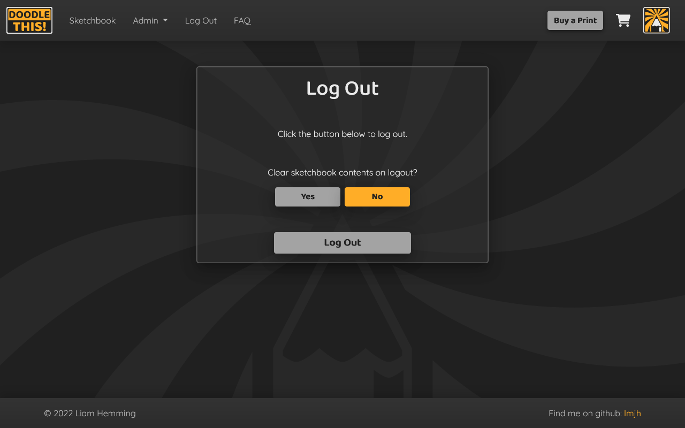
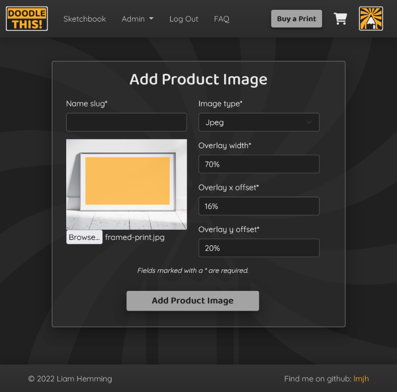

# Testing of Doodle This
## Code Validation

### HTML Validation

### CSS Validation

### Javascript Validation

### Python Validation

***

## User Stories Testing

#### 1. New User Stories

**1.1. As a new user I want to be able to quickly understand the purpose of the site so that I can decide if it provides value to me**

* Users are welcomed to the homepage with a welcome modal which describes the purposes of the site.
* Putting the sketchbook on the homepage also allows users to immediately see from the controls and layout that this is a drawing application.  

**1.2. As a new user I want to be able to quickly understand how to use the application so that I can start using it to create art**

* The welcome modal has a link to start a tour of the site's features which users can use to quickly get an overview of all controls.

* The tool icons are designed so that their purpose should be fairly clear to anyone familiar with drawing software, so users who don't want to take the tour should be able to use most features quickly anyway.  

**1.3. As a new user I want to be able to know where to look for help so that I can find answers to my questions**

* A large help button is situated in the sketchbook's left/top control panel, which launches the intro tour.  

* An FAQ is linked in the main navigation bar, which provides more information about the site.  

**1.4. As a new user I want to be able to easily sign up for an account so that I can store my details and save my artwork**

* Registration links are situated in the sketchbook's control panel for users who aren't signed in, and also in the main site nav.  

* Users can complete a simple form to register an account.  

#### 2. Registered User Stories

**2.1. As a registered user I want to be able to easily log in to or out of my account so that I can access the data I've stored**

* Links to the sign in page are situated in the sketchbook control panel and in the main site nav.  
  
  
* Users can complete a simple form to sign in. 
  

**2.2. As a registered user I want to be able to save my drawings so that I can access them later**

* The Save / Load button opens a save/load modal.  
  
* Users can save their drawings by selecting a save slot, clicking 'Save' and then confirming.  
  
  

**2.3. As a registered user I want to be able to edit my saved drawings so that I can make changes to them after they're saved**

* Users can load a drawing back into their sketchbook by selecting the saved drawing and then clicking 'Load'.  
  
* Once a drawing is loaded on the sketchbook, users can make any changes they like.  
  

**2.4. As a registered user I want to be able to delete my saved drawings so that I can get rid of old drawings and make space for new ones**

* Users can delete their saved drawings by clicking the Delete button in the Gallery section of the Account page.  
  
* A confirmation modal is opened to avoid accidental deletions. Once users confirm the deletion, the saved drawing is removed.  
  
  

**2.5. As a registered user I want to be able to save my shipping details so that I can checkout more quickly in future**

* Users can fill out and submit the shipping details form on the Account page to save their details.  
  
* Alternatively, ticking the 'Save my details' box on the checkout page will save the delivery information entered on that page in the user's account.  
  

#### 3. Drawing App User Stories

**3.1. As a drawing app user I want to be able to use a selection of basic drawing tools so that I can create drawings**

* Four basic drawing tools are provided for users.
* While more advanced drawing software might have many more tools, these four tools cover all of the basic requirements for creating drawings.  
  
* The pencil tool allows drawing lines of varying thickness (in combination with the stroke width slider).
* The fill tool allows filling large areas with colours.
* The eraser tool allows removing colours from parts of the canvas.
* The colour picker tool allows quickly selecting colours from the canvas.  

**3.2. As a drawing app user I want to be able to select from a number of preset colours so that I can quickly create art with a balanced palette**

* A range of preset colour options are provided.
* I took time to carefully select the palette, choosing colours that I thought would would work well together and cover a wide array of needs.
* There are six primary colours, six lighter pastel shades, four skin tone colours, two greys, white and black.  
  

**3.3. As a drawing app user I want to be able to use custom colours so that I can draw with any colour I want**

* A colour mixer is availabe which allows users can select any colour they wish.  
  
* Custom colours can be quickly retrieved from the canvas using the colour picker tool.  
  

**3.4. As a drawing app user I want to be able to generate random drawing prompts so that I can quickly get ideas about what to draw**

* Random drawing prompts are generated by functions from lists and displayed on the sketchbook page.
* Users can simply click the "New Prompt" button to generate a new prompt without leaving the page.   
  

  
#### 4. Shopper User Stories

**4.1. As a shopper I want to be able to purchase products printed with my drawing so that I can own or gift a physical copy of my drawing**

* Doodle This features an ecommerce shop that allows users to buy products printed with their drawings.
* A 'Buy a Print' link to the shop is prominently positioned in the nav bar and styled to stand out from the others.  
  
* On mobile screens, the button is usually hidden to save space, but the shopping cart logo is always visible, hinting that a shop is available, and the link is styled to stand out in the drop-down mobile nav.  
  

**4.2. As a shopper I want to be able to view the products available to purchase so that I can decide if there are any I'd like to buy**

* Clicking the 'Buy a Print' button takes users to a shop page where all of the available product types are listed.  
  

**4.3. As a shopper I want to be able to view product details so that I can find out more about the product and any variants available**

* When users click any of the product on the main shop page, they're taken to a details page for that product.  
  
* Users can select the product variant (i.e. the colour or size) they're interested in by selecting from a drop-down menu.
  
* Selecting different variants of the product can update the product description text and the price, if the variants have differing descriptions and/or prices.
  
  

**4.4. As a shopper I want to be able to view a preview of my drawing on a product so that I can get an idea of how my artwork would look when printed**

* The product page use javascript to overlay the user's drawings onto the product images, to provide a preview of how the print might look.  
  
* If users select a different drawing with the Select Doodle dropdown, the preview is automatically updated with the selected drawing.  
  
* Each product image is stored with its own set of overlay dimensions, so the print preview is scaled and positioned appropriately for the product image.  
  

**4.5. As a shopper I want to be able to easily manage my shopping cart so that I can select the products I want and see the costs**

* The shopping cart icon is always visible in the nav bar. A small coloured tag is positioned over it to show the current number of items in the cart.  
  
* Clicking the cart icon takes users to the cart page, where they can manage their cart items.  
  
* Users can update the quantity of a cart item or remove it from the cart.  
  
* If a user sets a new quantity and clicks 'Update', the cart price totals will also be updated.  
  
* Clicking the 'Remove' link removes the item from the cart.
  

**4.6. As a shopper I want to be able to easily checkout and pay for my order so that I can purchase the products I want**

* Clicking the 'Checkout Now' button on the shopping cart page takes users to a checkout form, where they can see a summary of their order and enter their delivery/payment details.  
  
* Users can simply complete the form and press 'Submit Order' to place an order.  
  
* Users are redirected to an order confirmation page to confirm their order has been placed.  
  
* Users also receive an email to confirm that their order has been placed.  
  
* The system uses webhooks as a reundancy system to create orders if there are any issues with the client side order process after a payment has been made.  
  

#### 5. Admin User Stories

**5.1. As a site administrator I want to be able to add new products and product variants so that I can sell new products in the store.**

* Users who are signed in and have the 'is_staff' BooleanField of their account set to true get access to a Product Management page.  
  
* The Product Management page shows details of all the Products, ProductVariants and ProductImages in the database.  
  
  
  
* Staff users can add a Product, ProductVariant, or ProductImage by clicking the 'Add' button beneath the relevant table and filling out a form.  
  
  

**5.2. As a site administrator I want to be able to update the products and product variants in the store so that I can change their details, prices and images.**

* Links are placed in the Product and ProductVariant tables to update pages for each product and variant.  
  
  
* Users can click the link to see a form populated with the item's current values.  
  
* Changing the values and the form updates the item in the database.  
  
  

**5.3. As a site administrator I want to be able to delete products and variants from the store so that I can remove products that are no longer sold.**

* Links are placed in the Product and ProductVariant tables to delete each product and variant.  
  
  
* Clicking the links opens a confirmation modal, to avoid accidental deletions.  
  
* When a user confirms the deletion, the relevant item is deleted from the database.  
  
* Some items are restricted to preserve database integrity (e.g. a user cannot delete a product if it currently has variants assigned to it). In these cases, messages are shown to inform users of which items are blocking the deletion, so they can reassign or delete those items to remove the restriction.  
  

***

## Automated Testing

***

## Responsiveness Testing

All the main pages of the site were tested for responsiveness using the Firefox browser Responsive Design Mode and screen widths of 350px, 810px and 1280px and screenshots are collected below. I tested all of the allauth account related pages, though for the sake of brevity I've only included screenshots of the tests of the most used pages (login, logout and register), as the pages all have very similar layouts.

|           Page           |                                     **Mobile (350px)**                                    |                                     **Tablet (810px)**                                    |                                     **Desktop (1280px)**                                    |
|:------------------------:|:-----------------------------------------------------------------------------------------:|:-----------------------------------------------------------------------------------------:|:-------------------------------------------------------------------------------------------:|
| **Sketchbook**           |            |            |            |
| **Logout**               |                |                |                |
| **Login**                |                 |                 |                 |
| **Signup**               |                |                |                |
| **Account**              |               |               |               |
| **Show All Prints**      |       |       |       |
| **Product Details**      |       |       |       |
| **Cart**                 |                  |                  |                  |
| **Checkout**             |              |              |              |
| **Order Confirmed**      |       |       |       |
| **Order Details**        |         |         |         |
| **Faq**                  |                   |                   |                   |
| **Product Management**   |    |    |    |
| **Add Product**          |           |           |           |
| **Edit Product**         |          |          |          |
| **Add Product Variant**  |   |   |   |
| **Edit Product Variant** |  |  |  |
| **Add Product Image**    |     |     |     |
| **Edit Product Image**   |    |    |    |

***

## Compatibility Testing

I tested the site for compatibility with Google Chrome, Mozilla Firefox and Microsoft Edge. I wasn't able to test Safari as I didn't have access to any Apple devices to test with.

I created a list of tests to check all of the site's functionality was working and all pages were displaying correctly. I ran through every test on all three browsers. 

|           Page           |                      **Test**                     |     **Chrome**     |     **Firefox**    |      **Edge**      |               **Notes**              |
|:------------------------:|:-------------------------------------------------:|:------------------:|:------------------:|:------------------:|:------------------------------------:|
|      **Sketchbook**      | Responsive layout rendering correctly             | :heavy_check_mark: | :heavy_check_mark: | :heavy_check_mark: |                                      |
|      **Sketchbook**      | All links functioning                             | :heavy_check_mark: | :heavy_check_mark: | :heavy_check_mark: |                                      |
|      **Sketchbook**      | All drawing tools functioning                     | :heavy_check_mark: | :heavy_check_mark: | :heavy_check_mark: |                                      |
|      **Sketchbook**      | All preset colours functioning                    | :heavy_check_mark: | :heavy_check_mark: | :heavy_check_mark: |                                      |
|      **Sketchbook**      | Coloris Color mixer functioning                   | :heavy_check_mark: | :heavy_check_mark: | :heavy_check_mark: |                                      |
|      **Sketchbook**      | All tool and canvas settings functioning          | :heavy_check_mark: | :heavy_check_mark: | :heavy_check_mark: |                                      |
|      **Sketchbook**      | All tool and canvas settings being stored         | :heavy_check_mark: | :heavy_check_mark: | :heavy_check_mark: |                                      |
|      **Sketchbook**      | Prompt generation functioning                     | :heavy_check_mark: | :heavy_check_mark: | :heavy_check_mark: |                                      |
|      **Sketchbook**      | Intro tour functioning                            | :heavy_check_mark: | :heavy_check_mark: | :heavy_check_mark: |                                      |
|      **Sketchbook**      | Save and load system functioning                  | :heavy_check_mark: | :heavy_check_mark: | :heavy_check_mark: | Canvas drift bug in Chrome and Edge. |
|      **Sketchbook**      | Undo functioning                                  | :heavy_check_mark: | :heavy_check_mark: | :heavy_check_mark: |                                      |
|      **Sketchbook**      | Autosave functioning                              | :heavy_check_mark: | :heavy_check_mark: | :heavy_check_mark: |                                      |
|      **Sketchbook**      | Welcome popup functioning                         | :heavy_check_mark: | :heavy_check_mark: | :heavy_check_mark: |                                      |
|      **Sketchbook**      | Welcome popup hidden on request                   | :heavy_check_mark: | :heavy_check_mark: | :heavy_check_mark: |                                      |
|        **Signup**        | Responsive layout rendering correctly             | :heavy_check_mark: | :heavy_check_mark: | :heavy_check_mark: |                                      |
|        **Signup**        | All links functioning                             | :heavy_check_mark: | :heavy_check_mark: | :heavy_check_mark: |                                      |
|        **Signup**        | All form/validation elements functioning          | :heavy_check_mark: | :heavy_check_mark: | :heavy_check_mark: |                                      |
|        **Signup**        | Able to register account                          | :heavy_check_mark: | :heavy_check_mark: | :heavy_check_mark: |                                      |
|         **Login**        | Responsive layout rendering correctly             | :heavy_check_mark: | :heavy_check_mark: | :heavy_check_mark: |                                      |
|         **Login**        | All links functioning                             | :heavy_check_mark: | :heavy_check_mark: | :heavy_check_mark: |                                      |
|         **Login**        | All form/validation elements functioning          | :heavy_check_mark: | :heavy_check_mark: | :heavy_check_mark: |                                      |
|         **Login**        | Able to log in                                    | :heavy_check_mark: | :heavy_check_mark: | :heavy_check_mark: |                                      |
|        **Logout**        | Responsive layout rendering correctly             | :heavy_check_mark: | :heavy_check_mark: | :heavy_check_mark: |                                      |
|        **Logout**        | Able to log out                                   | :heavy_check_mark: | :heavy_check_mark: | :heavy_check_mark: |                                      |
|        **Logout**        | Able to clear sketchbook on logout                | :heavy_check_mark: | :heavy_check_mark: | :heavy_check_mark: |                                      |
|        **Nav Bar**       | Responsive layout rendering correctly             | :heavy_check_mark: | :heavy_check_mark: | :heavy_check_mark: |                                      |
|        **Nav Bar**       | All links functioning                             | :heavy_check_mark: | :heavy_check_mark: | :heavy_check_mark: |                                      |
|        **Nav Bar**       | Correct links showing for user                    | :heavy_check_mark: | :heavy_check_mark: | :heavy_check_mark: |                                      |
|        **Nav Bar**       | Correct links showing for staff                   | :heavy_check_mark: | :heavy_check_mark: | :heavy_check_mark: |                                      |
|        **Account**       | Responsive layout rendering correctly             | :heavy_check_mark: | :heavy_check_mark: | :heavy_check_mark: |                                      |
|        **Account**       | All links functioning                             | :heavy_check_mark: | :heavy_check_mark: | :heavy_check_mark: |                                      |
|        **Account**       | All form/validation elements functioning          | :heavy_check_mark: | :heavy_check_mark: | :heavy_check_mark: |                                      |
|        **Account**       | Able to update details                            | :heavy_check_mark: | :heavy_check_mark: | :heavy_check_mark: |                                      |
|        **Account**       | Able to view saved drawings                       | :heavy_check_mark: | :heavy_check_mark: | :heavy_check_mark: |                                      |
|        **Account**       | Able to delete saved drawings                     | :heavy_check_mark: | :heavy_check_mark: | :heavy_check_mark: |                                      |
|        **Account**       | Order history displaying correctly                | :heavy_check_mark: | :heavy_check_mark: | :heavy_check_mark: |                                      |
|    **Show All Prints**   | Responsive layout rendering correctly             | :heavy_check_mark: | :heavy_check_mark: | :heavy_check_mark: |                                      |
|    **Show All Prints**   | All links functioning                             | :heavy_check_mark: | :heavy_check_mark: | :heavy_check_mark: |                                      |
|    **Show All Prints**   | All products displayed                            | :heavy_check_mark: | :heavy_check_mark: | :heavy_check_mark: |                                      |
|    **Product Details**   | Responsive layout rendering correctly             | :heavy_check_mark: | :heavy_check_mark: | :heavy_check_mark: |                                      |
|    **Product Details**   | All links functioning                             | :heavy_check_mark: | :heavy_check_mark: | :heavy_check_mark: |                                      |
|    **Product Details**   | Preview overlay rendering correctly               | :heavy_check_mark: | :heavy_check_mark: | :heavy_check_mark: |                                      |
|    **Product Details**   | Price, description and overlay updating correctly | :heavy_check_mark: | :heavy_check_mark: | :heavy_check_mark: |                                      |
|    **Product Details**   | Able to add to cart                               | :heavy_check_mark: | :heavy_check_mark: | :heavy_check_mark: |                                      |
|         **Cart**         | Responsive layout rendering correctly             | :heavy_check_mark: | :heavy_check_mark: | :heavy_check_mark: |                                      |
|         **Cart**         | All links functioning                             | :heavy_check_mark: | :heavy_check_mark: | :heavy_check_mark: |                                      |
|         **Cart**         | All form/validation elements functioning          | :heavy_check_mark: | :heavy_check_mark: | :heavy_check_mark: |                                      |
|         **Cart**         | Cart icon updating correctly                      | :heavy_check_mark: | :heavy_check_mark: | :heavy_check_mark: |                                      |
|         **Cart**         | Able to update quantities                         | :heavy_check_mark: | :heavy_check_mark: | :heavy_check_mark: |                                      |
|         **Cart**         | Able to remove items                              | :heavy_check_mark: | :heavy_check_mark: | :heavy_check_mark: |                                      |
|       **Checkout**       | Responsive layout rendering correctly             | :heavy_check_mark: | :heavy_check_mark: | :heavy_check_mark: |                                      |
|       **Checkout**       | All links functioning                             | :heavy_check_mark: | :heavy_check_mark: | :heavy_check_mark: |                                      |
|       **Checkout**       | All form/validation elements functioning          | :heavy_check_mark: | :heavy_check_mark: | :heavy_check_mark: |                                      |
|       **Checkout**       | Saved details prepopulating form                  | :heavy_check_mark: | :heavy_check_mark: | :heavy_check_mark: |                                      |
|       **Checkout**       | Able to save details                              | :heavy_check_mark: | :heavy_check_mark: | :heavy_check_mark: |                                      |
|       **Checkout**       | Stripe elements rendering correctly               | :heavy_check_mark: | :heavy_check_mark: | :heavy_check_mark: |                                      |
|       **Checkout**       | Able to place orders                              | :heavy_check_mark: | :heavy_check_mark: | :heavy_check_mark: |                                      |
|    **Order Confirmed**   | Responsive layout rendering correctly             | :heavy_check_mark: | :heavy_check_mark: | :heavy_check_mark: |                                      |
|    **Order Confirmed**   | Confimration email sent and received              | :heavy_check_mark: | :heavy_check_mark: | :heavy_check_mark: |                                      |
|     **Order Details**    | Responsive layout rendering correctly             | :heavy_check_mark: | :heavy_check_mark: | :heavy_check_mark: |                                      |
|          **FAQ**         | Responsive layout rendering correctly             | :heavy_check_mark: | :heavy_check_mark: | :heavy_check_mark: | Chrome and Edge card outline bug.    |
|          **FAQ**         | All links functioning                             | :heavy_check_mark: | :heavy_check_mark: | :heavy_check_mark: |                                      |
|  **Product Management**  | Responsive layout rendering correctly             | :heavy_check_mark: | :heavy_check_mark: | :heavy_check_mark: |                                      |
|  **Product Management**  | All links functioning                             | :heavy_check_mark: | :heavy_check_mark: | :heavy_check_mark: |                                      |
|  **Product Management**  | Able to delete products                           | :heavy_check_mark: | :heavy_check_mark: | :heavy_check_mark: |                                      |
|  **Product Management**  | Able to delete product variants                   | :heavy_check_mark: | :heavy_check_mark: | :heavy_check_mark: |                                      |
|  **Product Management**  | Able to delete product images                     | :heavy_check_mark: | :heavy_check_mark: | :heavy_check_mark: |                                      |
|      **Add Product**     | Responsive layout rendering correctly             | :heavy_check_mark: | :heavy_check_mark: | :heavy_check_mark: |                                      |
|      **Add Product**     | All form/validation elements functioning          | :heavy_check_mark: | :heavy_check_mark: | :heavy_check_mark: |                                      |
|      **Add Product**     | Able to add products                              | :heavy_check_mark: | :heavy_check_mark: | :heavy_check_mark: |                                      |
|     **Edit Product**     | Responsive layout rendering correctly             | :heavy_check_mark: | :heavy_check_mark: | :heavy_check_mark: |                                      |
|     **Edit Product**     | All form/validation elements functioning          | :heavy_check_mark: | :heavy_check_mark: | :heavy_check_mark: |                                      |
|     **Edit Product**     | Fields prepopulating with data correctly          | :heavy_check_mark: | :heavy_check_mark: | :heavy_check_mark: |                                      |
|     **Edit Product**     | Able to edit products                             | :heavy_check_mark: | :heavy_check_mark: | :heavy_check_mark: |                                      |
|  **Add Product Variant** | Responsive layout rendering correctly             | :heavy_check_mark: | :heavy_check_mark: | :heavy_check_mark: |                                      |
|  **Add Product Variant** | All form/validation elements functioning          | :heavy_check_mark: | :heavy_check_mark: | :heavy_check_mark: |                                      |
|  **Add Product Variant** | Able to add product variants                      | :heavy_check_mark: | :heavy_check_mark: | :heavy_check_mark: |                                      |
| **Edit Product Variant** | Responsive layout rendering correctly             | :heavy_check_mark: | :heavy_check_mark: | :heavy_check_mark: |                                      |
| **Edit Product Variant** | All form/validation elements functioning          | :heavy_check_mark: | :heavy_check_mark: | :heavy_check_mark: |                                      |
| **Edit Product Variant** | Fields prepopulating with data correctly          | :heavy_check_mark: | :heavy_check_mark: | :heavy_check_mark: |                                      |
| **Edit Product Variant** | Able to edit product variants                     | :heavy_check_mark: | :heavy_check_mark: | :heavy_check_mark: |                                      |
|   **Add Product Image**  | Responsive layout rendering correctly             | :heavy_check_mark: | :heavy_check_mark: | :heavy_check_mark: |                                      |
|   **Add Product Image**  | All form/validation elements functioning          | :heavy_check_mark: | :heavy_check_mark: | :heavy_check_mark: |                                      |
|   **Add Product Image**  | Image overlay preview functioning correctly       | :heavy_check_mark: | :heavy_check_mark: | :heavy_check_mark: |                                      |
|   **Add Product Image**  | Able to add product images                        | :heavy_check_mark: | :heavy_check_mark: | :heavy_check_mark: |                                      |
|  **Edit Product Image**  | Responsive layout rendering correctly             | :heavy_check_mark: | :heavy_check_mark: | :heavy_check_mark: |                                      |
|  **Edit Product Image**  | All form/validation elements functioning          | :heavy_check_mark: | :heavy_check_mark: | :heavy_check_mark: |                                      |
|  **Edit Product Image**  | Image overlay preview functioning correctly       | :heavy_check_mark: | :heavy_check_mark: | :heavy_check_mark: |                                      |
|  **Edit Product Image**  | Able to edit product images                       | :heavy_check_mark: | :heavy_check_mark: | :heavy_check_mark: |                                      |

Two issues were discovered during compatibility testing.

Firstly, I discovered an issue in Chrome and Edge where the user's drawings were drifting across canvas when saved and reloaded repeatedly. 

This bug has been fixed and more detail on this can be found in the 'Canvas Drift Bug' section of the [Bugs](BUGS.md) document.

Secondly, I discovered an issue in Chrome and Edge where the cards in the FAQ section had partial white outlines. This was simply caused by the card's white background being partially visible around the edge of a dark overlay that was on top of it. 

This was simply resolved by removing the overlay and changing the white background to dark grey with CSS.

***

## Bugs Fixed

Please see [BUGS.md](BUGS.md) for full details of bugs fixed.

***

## Outstanding Issues

